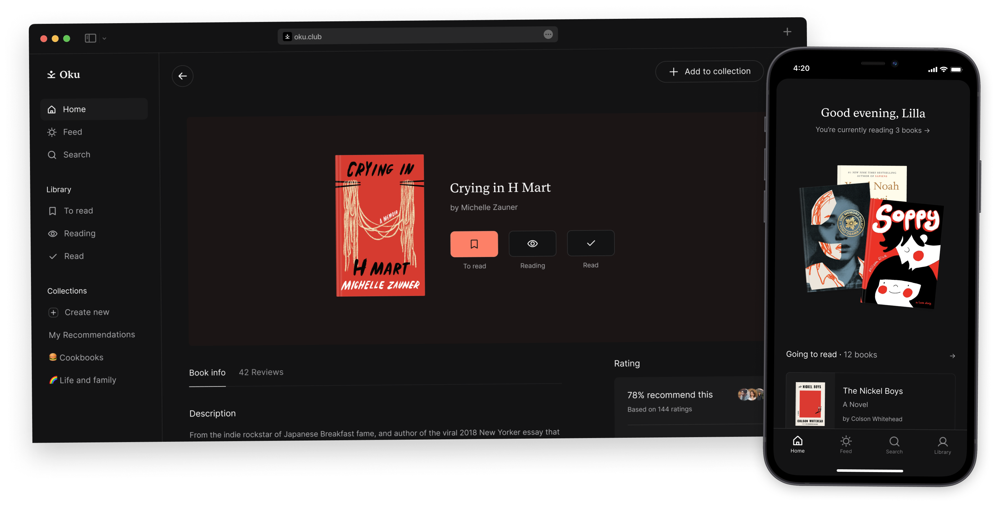
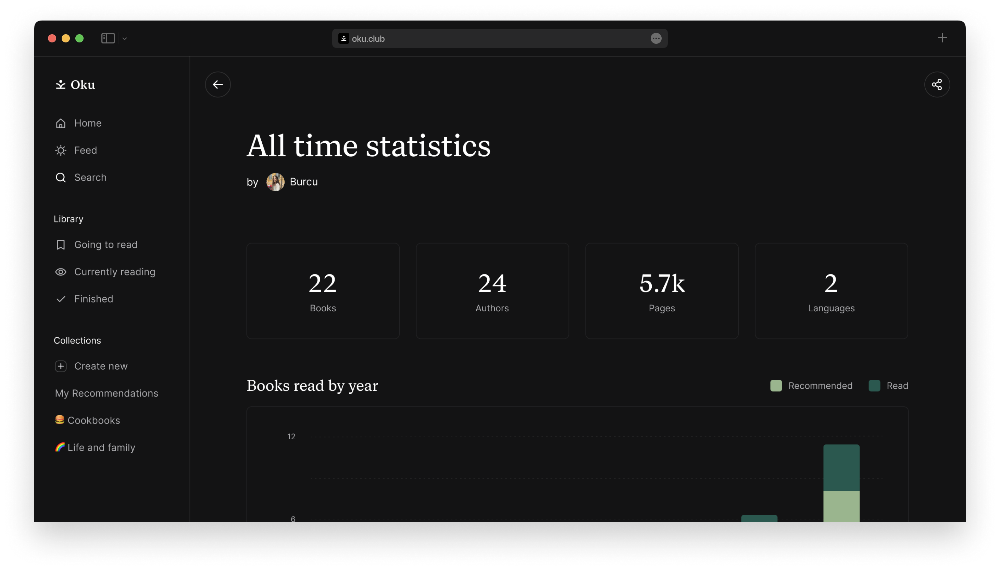
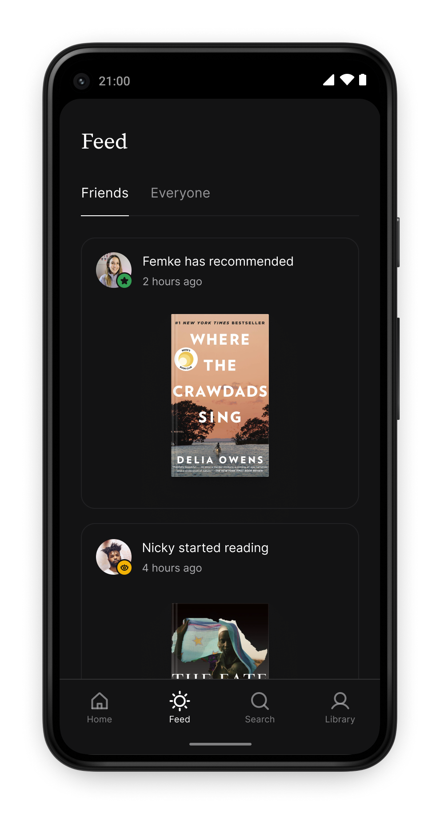

# Credify 🛡️

**Skills Genuinely Verified. Not Just Completed.**

Credify builds a credibility verification layer for online learning platforms. We verify whether you actually understood the content — not just clicked through it. Blockchain-backed, gasless, and genuinely trustworthy.

[](https://github.com/Sarthak030506/learncert-hackmumbai)

---

## 📖 The Problem We Solve
Developers and students are tired of meaningless completion badges. Traditional certificates prove you bought a course or clicked "Next," but they fail to prove actual understanding or engagement.

## ✨ Key Features & Capabilities

### 1. Verify Real Learning
We track active watch patterns, quiz consistency, engagement depth, and solving behavior to determine if you genuinely learned — no more meaningless completion badges.
<p align="center">
  
</p>

### 2. Deep Analytics & Trust Score
See detailed breakdowns of watch presence, tab focus rates, playback patterns, code originality scores, and solving consistency metrics. Your **Credify Score** reflects genuine understanding across platforms.
<p align="center">
  
</p>

### 3. Blockchain-Backed Certificates (Gasless)
Mint tamper-proof Soulbound Tokens (SBTs) as proof of verified learning. Powered by the **Universal Gas Fund (UGF)**, meaning all blockchain transactions are sponsored in the background. **No ETH or crypto wallet required.**
<p align="center">
  
</p>

### 4. Recruiter Verification Portal
Generate verification links that let employers audit your learning credentials — watch depth, solve patterns, and trust metrics — all on-chain and verifiable.
<p align="center">
  
</p>

### 5. Seamless Platform Integration
Connect your Udemy, Coursera, LeetCode, HackerRank, or YouTube learning accounts. The Credify extension silently monitors your real engagement.
<p align="center">
  
</p>

---

## 🛠️ Architecture & Tech Stack

Credify is structured into a monorepo-style setup that spans across Next.js (Web), a Browser Extension (Plasmo), and Smart Contracts:

- **Web App:** Next.js 16 (App Router), React 19, Tailwind CSS v4, Zustand, React Query, Recharts, Framer Motion, Firebase.
- **Chrome Extension:** Built with [Plasmo](https://docs.plasmo.com/). Tracks user focus, tab visibility, and learning interactions seamlessly.
- **Blockchain:** Ethers.js, Solidity Smart Contracts (Soulbound Tokens), and the `@tychilabs/ugf-testnet-js` for gasless transactions.

---

## 🚀 Getting Started

### 1. Web Platform (Next.js)

First, install dependencies and run the development server:
```bash
npm install
npm run dev
```

Open [http://localhost:3000](http://localhost:3000) with your browser to see the platform.

### 2. Browser Extension

Navigate to the extension directory:
```bash
cd credify-extension/extension
npm install
npm run dev
```
Then load the unpacked extension into Chrome from the `credify-extension/extension/build/chrome-mv3-dev` directory.

---

## 🎨 Design System

Credify utilizes a distinct **premium visual identity**:
- **Backgrounds:** Mesh gradient dark modes (`#000000`) and translucent glass card panels (`.premium-glass`).
- **Typography:** Heavy tracking uppercase (`tracking-tighter`, `tracking-[0.3em]`) for primary headings and system labels.
- **Micro-Animations:** Fluid scaling transitions on hover, dynamic ambient background glows, and pulse indicators for live sessions.

*(Refer to `gemini.md` for specific design tokens and CSS clones).*

---

## 👥 The Team
Six developers from Pune, India, building the future of credible online learning:
- **Omkar Rane**
- **Sarthak Godse**
- **Bhavjyot Singh**
- **Saksham Patil**
- **Vishnu Waghmare**
- **Jay Magar**
